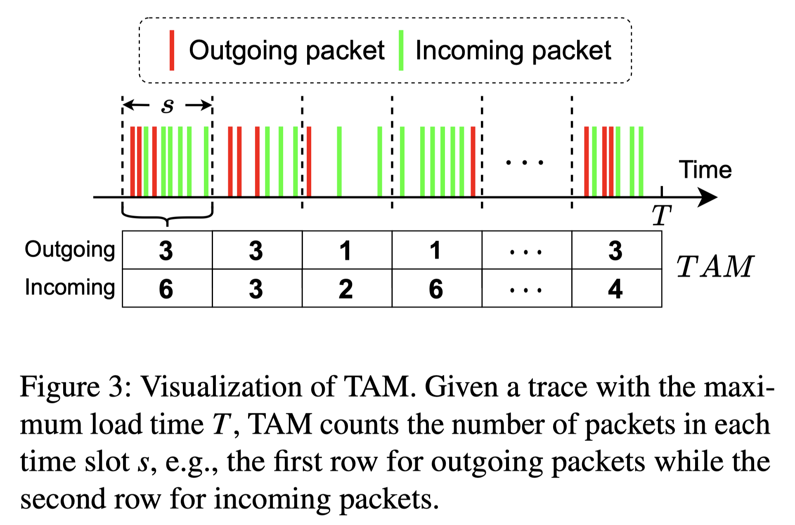
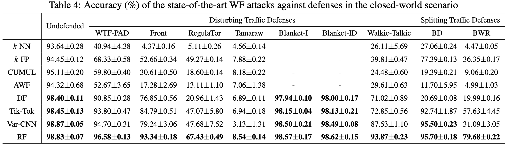
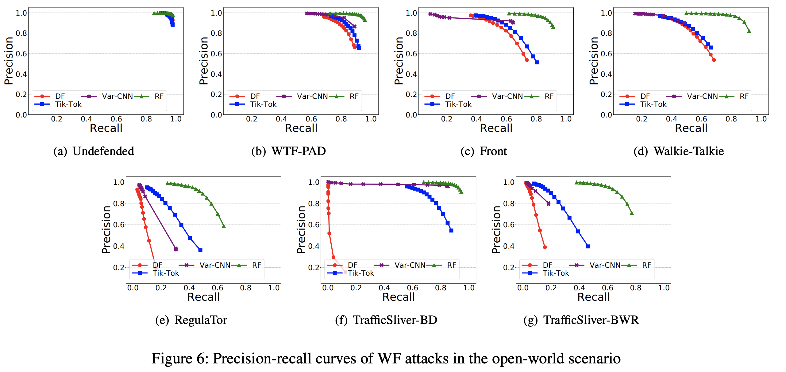

# USENIX Security 2023: Subverting Website Fingerprinting Defenses with Robust Traffic Representation

This is a Pytorch implementation of [Subverting Website Fingerprinting Defenses with Robust Traffic Representation.](https://www.usenix.org/conference/usenixsecurity23/presentation/shenmeng)   
   
The diagram of TAM extraction:


   
Architecture of the code:
```
ROBUST-FINGERPRINTING
├─ countermeasure
│  |  generate_defence.py (generate file for defended trace)
│  ├─ cam_dataset (folder to save the CAM score of the dataset)
│  │  └─ informative_regions (folder to save the Informative Regions of the dataset)
│  ├─ dataset (folder for .npy dataset)
│  ├─ get_cam
│  │     base_cam.py 
│  │     cam.py (file for CAM score computing)
│  │     cam_utils.py
│  ├─ list (random splited indices of the training and testing data with a 9:1 ratio)
│  ├─ models
│  │      RF_CAM.py (a fully-connected layer is appended after RF network to enable CAM computing)
│  ├─ pretrained
│  │      Undefence-train-packets_per_slot_CAM.pth (a trained model for RF_CAM)
│  ├─ result
│  └─ utils
│         const_exp.py (parameters of the countermeasure)
│         extract_from_cam.py (file for Informative Regions extraction)
│         my_utils.py (utils file including some useful functions)
└─  RF
    │  const_rf.py (parameters of the RF)
    │  extract-all.py (extract all traces from the dataset into a .npy file for 10-fold validation)
    │  extract-list.py (extract traces according to the training and testing indices and save them into .npy files)
    │  pre_recall.py (file for evaluating functions)
    │  test.py (test file for the dataset)
    │  train.py (train file for the dataset)
    │  train_10fold.py (10-fold validation)
    ├─ dataset (folder for .npy dataset)
    ├─ FeatureExtraction (folder for feature extraction functions)
    │     packets_per_slot.py (the extraction function of TAM)
    ├─ list (training and testing trace indices, also including the fastest&slowest loaded trace indices)
    ├─ models
    │     RF.py (RF network)
    ├─ pretrained (trained model folder)
    └─ result (folder for evaluation results)
```
:warning: The code is intended for RESEARCH PURPOSES ONLY! :warning:

## Preparation

### Environments
* Python Version: 3.6  

Use this command to install the required packages.
```commandline
pip3 install -r requirements.txt
```
### Datasets
We sincerely thank the authors for sharing their dataset. Two public real-world datasets used in our experiments are listed as follows:
* [Deep Fingerprinting](https://dl.acm.org/doi/pdf/10.1145/3243734.3243768): It contains 95 websites, each with 1,000 undefended traces, for closed-world evaluation. Excluding the 95 websites, it also includes 40,000 websites for open-world evaluation, each with only 1 undefended trace. This dataset is provided by [Rahman et al.](https://github.com/msrocean/Tik_Tok), and you can find the dataset on the [google drive link](https://drive.google.com/drive/folders/1k6X8PjKTXNalCiUQudx-HyqoAXVXRknL).
* [Walkie-Talkie](https://www.usenix.org/system/files/conference/usenixsecurity17/sec17-wang-tao.pdf): It contains 40,000 traces for 100 monitored websites and 40,000 traces for 10,000 unmonitored websites. For each monitored website, there are 400 traces, each representing a pairing of the corresponding monitored website and a randomly-selected unmonitored website (i.e., a decoy). Similarly, each trace of the unmonitored websites represents a pairing of the corresponding unmonitored website and a randomly-selected monitored website as the decoy. This dataset is provided by [Rahman et al](https://github.com/msrocean/Tik_Tok), and you can find the raw data [here](https://drive.google.com/file/d/1TUv43I9E3Av1JwraB5mapId4WQ4_NQ4C/view?usp=sharing) or use our preprocessed dataset [here](https://drive.google.com/file/d/1_dmmqDD6pDwcug4LBo6guHTgooUrB-be/view?usp=sharing).

For defended datasets, we use the simulator provided by the authors to generate the defended traces on the DF dataset. The GitHub links and some parameter settings are listed as follows:
* [WTF-PAD, FRONT, Tamaraw](https://github.com/websitefingerprinting/WebsiteFingerprinting)
* [RegulaTor](https://github.com/jkhollandjr/RegulaTor): `python3 regulator_sim.py dataset_directory/ output_directory/ --budget 2000 --orig_rate 277 --dep_rate .94 --threshold 3.55 --upload_ratio 3.95 --delay_cap 1.77`
* [Traffic-Sliver](https://github.com/TrafficSliver/splitting_simulator): $m = 3$
* [BLANKET](https://github.com/SPIN-UMass/BLANKET): $a = 1800$ for BLANKET-I and $a = 1000, μ = 0, σ=0.002$ for BLANKET-ID

## How to Run
There are several data paths you should change in the code, and we have marked them with `#TODO`.

### Robust Fingerprinting
#### Parameter Setting
You can find the parameter config information in `RF/const_rf.py`.
#### Feature Extraction
The following command can extract a randomly split training and testing dataset.
```commandline
python extract-list.py
```
or use the following command to extract all traces for 10-fold validation.
```commandline
python extract-all.py
```
The extracted dataset will be saved in `RF/dataset`.
#### Training
If you want to train the model on the dataset with the given training indices, you can use this command.   
```commandline
python train.py
```
If you want to train the model with 10-fold validation, you can use this command.
```commandline
python train_10fold.py
```
#### Evaluate
If you want to evaluate RF, you can use this command. And you need to change the trained model path to load different models and the test dataset path.
```commandline
python test.py
```

### CounterMeasure
#### Parameter Setting
You can find the parameter config information in countermeasure/utils/const_exp.py`.
#### Feature Extraction
You can follow feature extraction instructions in RF and then copy the extracted undefended dataset into `countermeasure/dataset`.
#### Training
You can find the trained model weights used in our experiments in countermeasure/pretrained/Undefence-train-packets_per_slot_CAM.pth`, if you want to train a new RF_CAM model, you can change the RF network to RF_CAM and then run ```train.py```. 
#### CAM Score Calculation
We followed the CAM score calculation of [Learning Deep Features for Discriminative Localization](https://arxiv.org/abs/1512.04150). You can find the origin code [here](https://github.com/jacobgil/pytorch-grad-cam).
Go to `countermeasure/get_cam` and change the model weights path, then use this command to compute the CAM score of the dataset. 
```commandline
python cam.py
```   
After that, the CAM score will be saved in `countermeasure/cam_dataset`.
#### Informative Regions Extraction
Go to `countermeasure/utils`. Run this command to extract the informative region sets.
```commandline
python extract_from_cam.py
``` 
The informative region sets will be saved in `countermeasure/informative_regions`.
#### Generate Defense
Run this command to generate the defended traces.
```commandline
python generate_defence.py
``` 
## Main Results

### Closed World


### Open World



## Contact
If you have any questions, please get in touch with us.
* Prof. Meng Shen ([shenmeng@bit.edu.cn](shenmeng@bit.edu.cn))
* Kexin Ji ([jikexin@bit.edu.cn](jikexin@bit.edu.cn))
